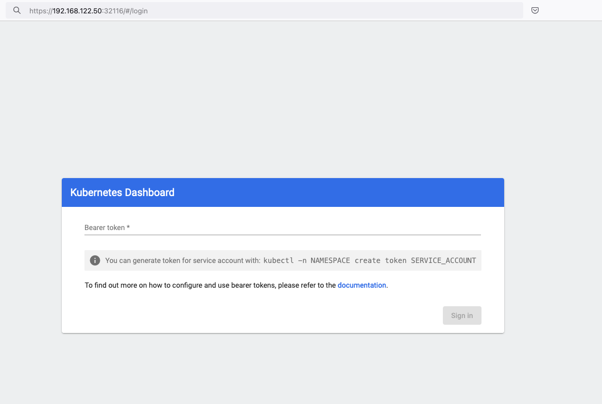

# Creating a kubernetes cluster with kubeadm on Ubuntu 24.04 LTS

> [Kubernetes](https://kubernetes.io/), also known as **k8s**, is an open-source system for automating deployment, scaling, and management of containerized applications.

***Notice*** The initial (old) blog post with ubuntu 22.04 is (still) here: [blog post](https://balaskas.gr/blog/2022/08/31/creating-a-kubernetes-cluster-with-kubeadm-on-ubuntu-2204-lts/)

<!-- toc -->

- [Prerequisites](#Prerequisites)
  * [Streamline the lab environment](#Streamline-the-lab-environment)
- [Git Terraform Code for the kubernetes cluster](#Git-Terraform-Code-for-the-kubernetes-cluster)
  * [Initilaze the working directory](#Initilaze-the-working-directory)
  * [Ubuntu 24.04 Image](#Ubuntu-2404-Image)
  * [Spawn the VMs](#Spawn-the-VMs)
- [Control-Plane Node](#Control-Plane-Node)
  * [Ports on the control-plane node](#Ports-on-the-control-plane-node)
  * [Firewall on the control-plane node](#Firewall-on-the-control-plane-node)
  * [Hosts file in the control-plane node](#Hosts-file-in-the-control-plane-node)
    + [Updating your hosts file](#Updating-your-hosts-file)
  * [No Swap on the control-plane node](#No-Swap-on-the-control-plane-node)
  * [Kernel modules on the control-plane node](#Kernel-modules-on-the-control-plane-node)
  * [NeedRestart on the control-plane node](#NeedRestart-on-the-control-plane-node)
    + [temporarily](#temporarily)
    + [permanently](#permanently)
  * [Installing a Container Runtime on the control-plane node](#Installing-a-Container-Runtime-on-the-control-plane-node)
  * [Installing kubeadm, kubelet and kubectl on the control-plane node](#Installing-kubeadm-kubelet-and-kubectl-on-the-control-plane-node)
  * [Get kubernetes admin configuration images](#Get-kubernetes-admin-configuration-images)
  * [Initializing the control-plane node](#Initializing-the-control-plane-node)
  * [Create user access config to the k8s control-plane node](#Create-user-access-config-to-the-k8s-control-plane-node)
  * [Verify the control-plane node](#Verify-the-control-plane-node)
  * [Install an overlay network provider on the control-plane node](#Install-an-overlay-network-provider-on-the-control-plane-node)
  * [Verify CoreDNS is running on the control-plane node](#Verify-CoreDNS-is-running-on-the-control-plane-node)
- [Worker Nodes](#Worker-Nodes)
  * [Ports on the worker nodes](#Ports-on-the-worker-nodes)
  * [Firewall on the worker nodes](#Firewall-on-the-worker-nodes)
  * [Hosts file in the worker node](#Hosts-file-in-the-worker-node)
  * [No Swap on the worker node](#No-Swap-on-the-worker-node)
  * [Kernel modules on the worker node](#Kernel-modules-on-the-worker-node)
  * [NeedRestart on the worker node](#NeedRestart-on-the-worker-node)
  * [Installing a Container Runtime on the worker node](#Installing-a-Container-Runtime-on-the-worker-node)
  * [Installing kubeadm, kubelet and kubectl on the worker node](#Installing-kubeadm-kubelet-and-kubectl-on-the-worker-node)
- [Get Token from the control-plane node](#Get-Token-from-the-control-plane-node)
  * [Get Certificate Hash from the control-plane node](#Get-Certificate-Hash-from-the-control-plane-node)
  * [Join Workers to the kubernetes cluster](#Join-Workers-to-the-kubernetes-cluster)
- [Is the kubernetes cluster running ?](#Is-the-kubernetes-cluster-running-)
  * [All nodes have successfully joined the Kubernetes cluster](#All-nodes-have-successfully-joined-the-Kubernetes-cluster)
  * [All pods](#All-pods)
- [Kubernetes Dashboard](#Kubernetes-Dashboard)
  * [Helm](#Helm)
  * [Install kubernetes dashboard](#Install-kubernetes-dashboard)
  * [Accessing Dashboard via a NodePort](#Accessing-Dashboard-via-a-NodePort)
    + [Patch kubernetes-dashboard](#Patch-kubernetes-dashboard)
    + [Edit kubernetes-dashboard Service](#Edit-kubernetes-dashboard-Service)
  * [Accessing Kubernetes Dashboard](#Accessing-Kubernetes-Dashboard)
  * [Create An Authentication Token (RBAC)](#Create-An-Authentication-Token-RBAC)
    + [Creating a Service Account](#Creating-a-Service-Account)
    + [Creating a ClusterRoleBinding](#Creating-a-ClusterRoleBinding)
    + [Getting a Bearer Token](#Getting-a-Bearer-Token)
  * [Browsing Kubernetes Dashboard](#Browsing-Kubernetes-Dashboard)
- [Nginx App](#Nginx-App)
  * [Install nginx-app](#Install-nginx-app)
  * [Get Deployment](#Get-Deployment)
  * [Expose Nginx-App](#Expose-Nginx-App)
  * [Verify Service nginx-app](#Verify-Service-nginx-app)
  * [Describe Service nginx-app](#Describe-Service-nginx-app)
  * [Curl Nginx-App](#Curl-Nginx-App)
  * [Nginx-App from Browser](#Nginx-App-from-Browser)
  * [Change the default page](#Change-the-default-page)
- [That's it](#Thats-it)
  * [destroy our lab](#destroy-our-lab)

<!-- tocstop -->

In this blog post, I’ll share my personal notes on setting up a kubernetes cluster using **kubeadm** on Ubuntu 24.04 LTS Virtual Machines.

For this setup, I will use three (3) Virtual Machines in my local lab. My home lab is built on libvirt with QEMU/KVM (Kernel-based Virtual Machine), and I use Terraform as the infrastructure provisioning tool.

## Prerequisites

- at least 3 Virtual Machines of Ubuntu 24.04 (one for control-plane, two for worker nodes)
- 2GB (or more) of RAM on each Virtual Machine
- 2 CPUs (or more) on each Virtual Machine
- 20Gb of hard disk on each Virtual Machine
- No SWAP partition/image/file on each Virtual Machine

### Streamline the lab environment

To simplify the Terraform code for the libvirt/QEMU Kubernetes lab, I’ve made a few adjustments so that all of the VMs use the below default values:

- ssh port: 22/TCP
- volume size: 40G
- memory: 4096
- cpu: 4

Review the values and adjust them according to your requirements and limitations.

## Git Terraform Code for the kubernetes cluster

I prefer maintaining a reproducible infrastructure so that I can quickly create and destroy my test lab. My approach involves testing each step, so I often destroy everything, copy and paste commands, and move forward. I use Terraform to provision the infrastructure. You can find the full Terraform code for the Kubernetes cluster here: [k8s cluster - Terraform code](https://github.com/ebal/k8s_cluster/tree/main/tf_libvirt).

> If you do not use terraform, skip this step!

You can `git clone` the repo to review and edit it according to your needs.

```bash
git clone https://github.com/ebal/k8s_cluster.git
cd tf_libvirt

```

You will **need** to make appropriate changes. Open **Variables.tf** for that. The most important option to change, is the **User** option. Change it to your github username and it will download and setup the VMs with your public key, instead of mine!

But pretty much, everything else should work out of the box. Change the **vmem** and **vcpu** settings to your needs.

### Initilaze the working directory

**Init** terraform before running the below shell script.
This action will download in your local directory all the required teffarorm providers or modules.

```bash
terraform init

```

### Ubuntu 24.04 Image

Before proceeding with creating the VMs, we need to ensure that the Ubuntu 24.04 image is available on our system, or modify the code to download it from the internet.

In **Variables.tf** terraform file, you will notice the below entries

```yaml
# The image source of the VM
# cloud_image = "https://cloud-images.ubuntu.com/oracular/current/focal-server-cloudimg-amd64.img"
cloud_image = "../oracular-server-cloudimg-amd64.img"

```

If you do not want to download the Ubuntu 24.04 cloud server image then make the below change

```yaml
# The image source of the VM
cloud_image = "https://cloud-images.ubuntu.com/oracular/current/focal-server-cloudimg-amd64.img"
# cloud_image = "../oracular-server-cloudimg-amd64.img"

```

otherwise you need to download it, in the upper directory, to speed things up

```bash
cd ../
IMAGE="oracular" # 24.04
curl -sLO https://cloud-images.ubuntu.com/${IMAGE}/current/${IMAGE}-server-cloudimg-amd64.img
cd -

ls -l ../oracular-server-cloudimg-amd64.img

```

### Spawn the VMs

We are ready to spawn our 3 VMs by running `terraform plan` & `terraform apply`

```bash
./start.sh

```

output should be something like:

```
...
Apply complete! Resources: 16 added, 0 changed, 0 destroyed.

Outputs:

VMs = [
  "192.168.122.223 k8scpnode1",
  "192.168.122.50  k8swrknode1",
  "192.168.122.10  k8swrknode2",
]

```

Verify that you have ssh access to the VMs

eg.

```bash
ssh ubuntu@192.168.122.223

```

Replace the IP with the one provided in the output.

***DISCLAIMER*** if something failed, destroy everything with `./destroy.sh` to remove any garbages before run `./start.sh` again!!

## Control-Plane Node

Let’s now begin configuring the Kubernetes control-plane node.

### Ports on the control-plane node

Kubernetes runs a few services that needs to be accessable from the worker nodes.

| Protocol | Direction | Port Range | Purpose                 | Used By              |
|----------|-----------|------------|-------------------------|----------------------|
| TCP      | Inbound   | 6443       | Kubernetes API server   | All                  |
| TCP      | Inbound   | 2379-2380  | etcd server client API  | kube-apiserver, etcd |
| TCP      | Inbound   | 10250      | Kubelet API             | Self, Control plane  |
| TCP      | Inbound   | 10259      | kube-scheduler          | Self                 |
| TCP      | Inbound   | 10257      | kube-controller-manager | Self                 |

Although etcd ports are included in control plane section, you can also host your
own **etcd** cluster externally or on custom ports.

### Firewall on the control-plane node

We need to open the necessary ports on the CP's (control-plane node) firewall.

```bash
sudo ufw allow 6443/tcp
sudo ufw allow 2379:2380/tcp
sudo ufw allow 10250/tcp
sudo ufw allow 10259/tcp
sudo ufw allow 10257/tcp

# sudo ufw disable
sudo ufw status

```

the output should be

```
To                         Action      From
--                         ------      ----
22/tcp                     ALLOW       Anywhere
6443/tcp                   ALLOW       Anywhere
2379:2380/tcp              ALLOW       Anywhere
10250/tcp                  ALLOW       Anywhere
10259/tcp                  ALLOW       Anywhere
10257/tcp                  ALLOW       Anywhere
22/tcp (v6)                ALLOW       Anywhere (v6)
6443/tcp (v6)              ALLOW       Anywhere (v6)
2379:2380/tcp (v6)         ALLOW       Anywhere (v6)
10250/tcp (v6)             ALLOW       Anywhere (v6)
10259/tcp (v6)             ALLOW       Anywhere (v6)
10257/tcp (v6)             ALLOW       Anywhere (v6)
```

### Hosts file in the control-plane node

We need to update the `/etc/hosts` with the internal IP and hostname.
This will help when it is time to join the worker nodes.

```bash
echo $(hostname -I) $(hostname) | sudo tee -a /etc/hosts

```

Just a reminder: we need to update the hosts file to all the VMs.
To include all the VMs' IPs and hostnames.

If you already know them, then your `/etc/hosts` file should look like this:

```
192.168.122.223 k8scpnode1
192.168.122.50  k8swrknode1
192.168.122.10  k8swrknode2
```

replace the IPs to yours.

#### Updating your hosts file

if you already the IPs of your VMs, run the below script to ALL 3 VMs

```bash
sudo tee -a /etc/hosts <<EOF

192.168.122.223 k8scpnode1
192.168.122.50  k8swrknode1
192.168.122.10  k8swrknode2
EOF

```

### No Swap on the control-plane node

Be sure that **SWAP** is disabled in all virtual machines!

```bash
sudo swapoff -a

```

and the fstab file should not have any swap entry.

The below command should return nothing.

```bash
sudo grep -i swap /etc/fstab

```

If not, edit the `/etc/fstab` and remove the swap entry.

If you follow my terraform k8s code example from the above github repo,
you will notice that there isn't any swap entry in the cloud init (user-data) file.

Nevertheless it is always a good thing to douple check.

### Kernel modules on the control-plane node

We need to load the below kernel modules on all k8s nodes, so k8s can create some network magic!

- overlay
- br_netfilter

Run the below bash snippet that will do that, and also will enable the forwarding features of the network.

```bash
sudo tee /etc/modules-load.d/kubernetes.conf <<EOF
overlay
br_netfilter
EOF

sudo modprobe overlay
sudo modprobe br_netfilter

sudo lsmod | grep netfilter

sudo tee /etc/sysctl.d/kubernetes.conf <<EOF
net.bridge.bridge-nf-call-ip6tables = 1
net.bridge.bridge-nf-call-iptables = 1
net.ipv4.ip_forward = 1
EOF

sudo sysctl --system

```

### NeedRestart on the control-plane node

Before installing any software, we need to make a tiny change to **needrestart** program. This will help with the automation of installing packages and will stop asking -via dialog- if we would like to restart the services!

#### temporarily

```bash
export -p NEEDRESTART_MODE="a"

```

#### permanently

a more permanent way, is to update the configuration file

```bash
echo "\$nrconf{restart} = 'a';" | sudo tee -a /etc/needrestart/needrestart.conf

```

### Installing a Container Runtime on the control-plane node

It is time to choose which container runtime we are going to use on our k8s cluster. There are a few container runtimes for k8s and in the past **docker** were used to. Nowadays the most common runtime is the **containerd** that can also uses the cgroup v2 kernel features. There is also a docker-engine runtime via CRI. Read [here](https://kubernetes.io/docs/setup/production-environment/container-runtimes/) for more details on the subject.

```bash
curl -sL https://download.docker.com/linux/ubuntu/gpg | sudo gpg --dearmor -o /etc/apt/trusted.gpg.d/docker-keyring.gpg

sudo apt-add-repository -y "deb https://download.docker.com/linux/ubuntu oracular stable"

sleep 3

sudo apt-get -y install containerd.io

containerd config default                              \
 | sed 's/SystemdCgroup = false/SystemdCgroup = true/' \
 | sudo tee /etc/containerd/config.toml

sudo systemctl restart containerd.service

```

You can find the containerd configuration file here:
    /etc/containerd/config.toml


In earlier versions of ubuntu we should enable the `systemd cgroup driver`.
Recomendation from official documentation is:
> It is best to use cgroup v2, use the systemd cgroup driver instead of cgroupfs.

Starting with v1.22 and later, when creating a cluster with kubeadm, if the user does not set the cgroupDriver field under KubeletConfiguration, kubeadm defaults it to systemd.

### Installing kubeadm, kubelet and kubectl on the control-plane node

Install the kubernetes packages (kubedam, kubelet and kubectl) by first adding the k8s repository on our virtual machine. To speed up the next step, we will also download the configuration container images.

This guide is using kubeadm, so we need to check the latest version.

Kubernetes v1.31 is the latest version when this guide was written.

```bash
VERSION="1.31"

curl -fsSL https://pkgs.k8s.io/core:/stable:/v${VERSION}/deb/Release.key | sudo gpg --dearmor -o /etc/apt/keyrings/kubernetes-apt-keyring.gpg

# allow unprivileged APT programs to read this keyring
sudo chmod 0644 /etc/apt/keyrings/kubernetes-apt-keyring.gpg

# This overwrites any existing configuration in /etc/apt/sources.list.d/kubernetes.list
echo "deb [signed-by=/etc/apt/keyrings/kubernetes-apt-keyring.gpg] https://pkgs.k8s.io/core:/stable:/v${VERSION}/deb/ /" | sudo tee /etc/apt/sources.list.d/kubernetes.list

# helps tools such as command-not-found to work correctly
sudo chmod 0644 /etc/apt/sources.list.d/kubernetes.list

sleep 2

sudo apt-get update
sudo apt-get install -y kubelet kubeadm kubectl

```

### Get kubernetes admin configuration images

Retrieve the Kubernetes admin configuration images.

```bash
sudo kubeadm config images pull

```

### Initializing the control-plane node

We can now proceed with initializing the control-plane node for our Kubernetes cluster.

There are a few things we need to be careful about:

- We can specify the control-plane-endpoint if we are planning to have a high available k8s cluster. (we will skip this for now),
- Choose a Pod network add-on (next section) but be aware that CoreDNS (DNS and Service Discovery) will not run till then (later),
- define where is our container runtime socket (we will skip it)
- advertise the API server (we will skip it)

But we will define our Pod Network CIDR to the default value of the Pod network add-on so everything will go smoothly later on.

```bash
sudo kubeadm init --pod-network-cidr=10.244.0.0/16

```

Keep the output in a notepad.

### Create user access config to the k8s control-plane node

Our k8s control-plane node is running, so we need to have credentials to access it.

The **kubectl** reads a configuration file (that has the token), so we copying this from k8s admin.

```bash
rm -rf $HOME/.kube
mkdir -p $HOME/.kube

sudo cp -i /etc/kubernetes/admin.conf $HOME/.kube/config

sudo chown $(id -u):$(id -g) $HOME/.kube/config

ls -la $HOME/.kube/config

echo 'alias k="kubectl"' | sudo tee -a /etc/bash.bashrc
source /etc/bash.bashrc

```

### Verify the control-plane node

Verify that the kubernets is running.

That means we have a k8s cluster - but only the control-plane node is running.

```bash
kubectl cluster-info
# kubectl cluster-info dump

kubectl get nodes   -o wide
kubectl get pods -A -o wide

```

### Install an overlay network provider on the control-plane node

As I mentioned above, in order to use the DNS and Service Discovery services in the kubernetes (CoreDNS) we need to install a Container Network Interface (CNI) based Pod network add-on so that your Pods can communicate with each other.

Kubernetes **[Flannel](https://github.com/flannel-io/flannel)** is a popular network overlay solution for Kubernetes clusters, primarily used to enable networking between pods across different nodes. It's a simple and easy-to-implement network fabric that uses the VXLAN protocol to create a flat virtual network, allowing Kubernetes pods to communicate with each other across different hosts.

Make sure to open the below udp ports for flannel’s VXLAN traffic (if you are going to use it):

```bash
sudo ufw allow 8472/udp

```

To install Flannel as the networking solution for your Kubernetes (K8s) cluster, run the following command to deploy Flannel:

```bash
k apply -f https://raw.githubusercontent.com/flannel-io/flannel/master/Documentation/kube-flannel.yml

```

### Verify CoreDNS is running on the control-plane node

Verify that the control-plane node is Up & Running and the control-plane pods (as coredns pods) are also running

```bash
k get nodes -o wide

```

```bash
NAME        STATUS  ROLES          AGE  VERSION  INTERNAL-IP      EXTERNAL-IP  OS-IMAGE      KERNEL-VERSION    CONTAINER-RUNTIME
k8scpnode1  Ready   control-plane  12m  v1.31.3  192.168.122.223  <none>       Ubuntu 24.10  6.11.0-9-generic  containerd://1.7.23

```

```bash
k get pods -A -o wide

```

```bash
NAMESPACE     NAME                                READY  STATUS   RESTARTS  AGE    IP               NODE        NOMINATED NODE  READINESS GATES
kube-flannel  kube-flannel-ds-9v8fq               1/1    Running  0         2m17s  192.168.122.223  k8scpnode1  <none>          <none>
kube-system   coredns-7c65d6cfc9-dg6nq            1/1    Running  0         12m    10.244.0.2       k8scpnode1  <none>          <none>
kube-system   coredns-7c65d6cfc9-r4ksc            1/1    Running  0         12m    10.244.0.3       k8scpnode1  <none>          <none>
kube-system   etcd-k8scpnode1                     1/1    Running  0         13m    192.168.122.223  k8scpnode1  <none>          <none>
kube-system   kube-apiserver-k8scpnode1           1/1    Running  0         12m    192.168.122.223  k8scpnode1  <none>          <none>
kube-system   kube-controller-manager-k8scpnode1  1/1    Running  0         12m    192.168.122.223  k8scpnode1  <none>          <none>
kube-system   kube-proxy-sxtk9                    1/1    Running  0         12m    192.168.122.223  k8scpnode1  <none>          <none>
kube-system   kube-scheduler-k8scpnode1           1/1    Running  0         13m    192.168.122.223  k8scpnode1  <none>          <none>

```

<p>&nbsp;</p>
<p>&nbsp;</p>
<p>&nbsp;</p>

<p>
  That's it with the control-plane node !
</p>

---

<p>&nbsp;</p>
<p>&nbsp;</p>
<p>&nbsp;</p>

## Worker Nodes

The following instructions apply similarly to both worker nodes. I will document the steps for the **k8swrknode1** node, but please follow the same process for the **k8swrknode2** node.

### Ports on the worker nodes

As we learned above on the control-plane section, kubernetes runs a few services

| Protocol | Direction | Port Range  | Purpose           | Used By              |
|----------|-----------|-------------|-------------------|----------------------|
| TCP      | Inbound   | 10250       | Kubelet API       | Self, Control plane  |
| TCP      | Inbound   | 10256       | kube-proxy        | Self, Load balancers |
| TCP      | Inbound   | 30000-32767 | NodePort Services | All                  |

### Firewall on the worker nodes

so we need to open the necessary ports on the worker nodes too.

```bash
sudo ufw allow 10250/tcp
sudo ufw allow 10256/tcp
sudo ufw allow 30000:32767/tcp

sudo ufw status

```

The output should appear as follows:

```
To                         Action      From
--                         ------      ----
22/tcp                     ALLOW       Anywhere
10250/tcp                  ALLOW       Anywhere
30000:32767/tcp            ALLOW       Anywhere
22/tcp (v6)                ALLOW       Anywhere (v6)
10250/tcp (v6)             ALLOW       Anywhere (v6)
30000:32767/tcp (v6)       ALLOW       Anywhere (v6)
```

and do not forget, we also need to open UDP 8472 for flannel

```bash
sudo ufw allow 8472/udp

```

The next few steps are pretty much exactly the same as in the control-plane node.
In order to keep this documentation short, I'll just copy/paste the commands.

### Hosts file in the worker node

Update the `/etc/hosts` file to include the IPs and hostname of all VMs.

```bash
192.168.122.223 k8scpnode1
192.168.122.50  k8swrknode1
192.168.122.10  k8swrknode2

```

### No Swap on the worker node

```bash
sudo swapoff -a

```

### Kernel modules on the worker node

```bash
sudo tee /etc/modules-load.d/kubernetes.conf <<EOF
overlay
br_netfilter
EOF

sudo modprobe overlay
sudo modprobe br_netfilter

sudo lsmod | grep netfilter

sudo tee /etc/sysctl.d/kubernetes.conf <<EOF
net.bridge.bridge-nf-call-ip6tables = 1
net.bridge.bridge-nf-call-iptables = 1
net.ipv4.ip_forward = 1
EOF

sudo sysctl --system

```

### NeedRestart on the worker node

```bash
export -p NEEDRESTART_MODE="a"

```

### Installing a Container Runtime on the worker node

```bash
curl -sL https://download.docker.com/linux/ubuntu/gpg | sudo gpg --dearmor -o /etc/apt/trusted.gpg.d/docker-keyring.gpg

sudo apt-add-repository -y "deb https://download.docker.com/linux/ubuntu oracular stable"

sleep 3

sudo apt-get -y install containerd.io

containerd config default                              \
 | sed 's/SystemdCgroup = false/SystemdCgroup = true/' \
 | sudo tee /etc/containerd/config.toml

sudo systemctl restart containerd.service

```

### Installing kubeadm, kubelet and kubectl on the worker node

```bash
VERSION="1.31"

curl -fsSL https://pkgs.k8s.io/core:/stable:/v${VERSION}/deb/Release.key | sudo gpg --dearmor -o /etc/apt/keyrings/kubernetes-apt-keyring.gpg

# allow unprivileged APT programs to read this keyring
sudo chmod 0644 /etc/apt/keyrings/kubernetes-apt-keyring.gpg

# This overwrites any existing configuration in /etc/apt/sources.list.d/kubernetes.list
echo "deb [signed-by=/etc/apt/keyrings/kubernetes-apt-keyring.gpg] https://pkgs.k8s.io/core:/stable:/v${VERSION}/deb/ /" | sudo tee /etc/apt/sources.list.d/kubernetes.list

# helps tools such as command-not-found to work correctly
sudo chmod 0644 /etc/apt/sources.list.d/kubernetes.list

sleep 3

sudo apt-get update
sudo apt-get install -y kubelet kubeadm kubectl

```

## Get Token from the control-plane node

To join nodes to the kubernetes cluster, we need to have a couple of things.

1. a token from control-plane node
2. the CA certificate hash from the contol-plane node.

If you didnt keep the output the initialization of the control-plane node, that's okay.

Run the below command in the control-plane node.

```bash
sudo kubeadm token list

```

and we will get the initial token that expires after 24hours.

```
TOKEN                    TTL  EXPIRES               USAGES                  DESCRIPTION                                               EXTRA GROUPS
7n4iwm.8xqwfcu4i1co8nof  23h  2024-11-26T12:14:55Z  authentication,signing  The default bootstrap token generated by 'kubeadm init'.  system:bootstrappers:kubeadm:default-node-token
```

In this case is the

    7n4iwm.8xqwfcu4i1co8nof

### Get Certificate Hash from the control-plane node

To get the CA certificate hash from the control-plane-node, we need to run a complicated command:

```bash
openssl x509 -pubkey -in /etc/kubernetes/pki/ca.crt | openssl rsa -pubin -outform der 2>/dev/null | openssl dgst -sha256 -hex | sed 's/^.* //'

```

and in my k8s cluster is:

    2f68e4b27cae2d2a6431f3da308a691d00d9ef3baa4677249e43b3100d783061

### Join Workers to the kubernetes cluster

So now, we can Join our worker nodes to the kubernetes cluster.
Run the below command on both worker nodes:

```bash
sudo kubeadm join 192.168.122.223:6443  \
        --token 7n4iwm.8xqwfcu4i1co8nof \
        --discovery-token-ca-cert-hash sha256:2f68e4b27cae2d2a6431f3da308a691d00d9ef3baa4677249e43b3100d783061

```

we get this message

> Run 'kubectl get nodes' on the control-plane to see this node join the cluster.

## Is the kubernetes cluster running ?

We can verify that

```bash
kubectl get nodes   -o wide
kubectl get pods -A -o wide

```

### All nodes have successfully joined the Kubernetes cluster

so make sure they are in **Ready** status.

```
k8scpnode1   Ready  control-plane  58m    v1.31.3  192.168.122.223  <none>  Ubuntu 24.10  6.11.0-9-generic  containerd://1.7.23
k8swrknode1  Ready  <none>         3m37s  v1.31.3  192.168.122.50   <none>  Ubuntu 24.10  6.11.0-9-generic  containerd://1.7.23
k8swrknode2  Ready  <none>         3m37s  v1.31.3  192.168.122.10   <none>  Ubuntu 24.10  6.11.0-9-generic  containerd://1.7.23
```

### All pods

so make sure all pods are in **Running** status.

```
NAMESPACE     NAME                                READY  STATUS   RESTARTS  AGE    IP               NODE         NOMINATED NODE  READINESS GATES
kube-flannel  kube-flannel-ds-9v8fq               1/1    Running  0         46m    192.168.122.223  k8scpnode1   <none>          <none>
kube-flannel  kube-flannel-ds-hmtmv               1/1    Running  0         3m32s  192.168.122.50   k8swrknode1  <none>          <none>
kube-flannel  kube-flannel-ds-rwkrm               1/1    Running  0         3m33s  192.168.122.10   k8swrknode2  <none>          <none>
kube-system   coredns-7c65d6cfc9-dg6nq            1/1    Running  0         57m    10.244.0.2       k8scpnode1   <none>          <none>
kube-system   coredns-7c65d6cfc9-r4ksc            1/1    Running  0         57m    10.244.0.3       k8scpnode1   <none>          <none>
kube-system   etcd-k8scpnode1                     1/1    Running  0         57m    192.168.122.223  k8scpnode1   <none>          <none>
kube-system   kube-apiserver-k8scpnode1           1/1    Running  0         57m    192.168.122.223  k8scpnode1   <none>          <none>
kube-system   kube-controller-manager-k8scpnode1  1/1    Running  0         57m    192.168.122.223  k8scpnode1   <none>          <none>
kube-system   kube-proxy-49f6q                    1/1    Running  0         3m32s  192.168.122.50   k8swrknode1  <none>          <none>
kube-system   kube-proxy-6qpph                    1/1    Running  0         3m33s  192.168.122.10   k8swrknode2  <none>          <none>
kube-system   kube-proxy-sxtk9                    1/1    Running  0         57m    192.168.122.223  k8scpnode1   <none>          <none>
kube-system   kube-scheduler-k8scpnode1           1/1    Running  0         57m    192.168.122.223  k8scpnode1   <none>          <none>
```

That's it !

Our **k8s cluster** is running.

<p>&nbsp;</p>
<p>&nbsp;</p>
<p>&nbsp;</p>

---

<p>&nbsp;</p>
<p>&nbsp;</p>
<p>&nbsp;</p>

## Kubernetes Dashboard

> is a general purpose, web-based UI for Kubernetes clusters. It allows users to manage applications running in the cluster and troubleshoot them, as well as manage the cluster itself.

Next, we can move forward with installing the Kubernetes dashboard on our cluster.

### Helm

Helm—a package manager for Kubernetes that simplifies the process of deploying applications to a Kubernetes cluster. As of version 7.0.0, kubernetes-dashboard has dropped support for Manifest-based installation. Only Helm-based installation is supported now.

Live on the edge !

```bash
curl -sL https://raw.githubusercontent.com/helm/helm/main/scripts/get-helm-3 | bash

```

### Install kubernetes dashboard

We need to add the kubernetes-dashboard helm repository first and install the helm chart after:

```bash
# Add kubernetes-dashboard repository
helm repo add kubernetes-dashboard https://kubernetes.github.io/dashboard/

# Deploy a Helm Release named "kubernetes-dashboard" using the kubernetes-dashboard chart
helm upgrade --install kubernetes-dashboard kubernetes-dashboard/kubernetes-dashboard --create-namespace --namespace kubernetes-dashboard

```

The output of the command above should resemble something like this:

```bash
Release "kubernetes-dashboard" does not exist. Installing it now.

NAME: kubernetes-dashboard
LAST DEPLOYED: Mon Nov 25 15:36:51 2024
NAMESPACE: kubernetes-dashboard
STATUS: deployed
REVISION: 1
TEST SUITE: None

NOTES:
*************************************************************************************************
*** PLEASE BE PATIENT: Kubernetes Dashboard may need a few minutes to get up and become ready ***
*************************************************************************************************

Congratulations! You have just installed Kubernetes Dashboard in your cluster.

To access Dashboard run:
  kubectl -n kubernetes-dashboard port-forward svc/kubernetes-dashboard-kong-proxy 8443:443

NOTE: In case port-forward command does not work, make sure that kong service name is correct.
      Check the services in Kubernetes Dashboard namespace using:
        kubectl -n kubernetes-dashboard get svc

Dashboard will be available at:
  https://localhost:8443

```

Verify the installation

`kubectl -n kubernetes-dashboard get svc`

```
NAME                                   TYPE        CLUSTER-IP       EXTERNAL-IP   PORT(S)    AGE
kubernetes-dashboard-api               ClusterIP   10.106.254.153   <none>        8000/TCP   3m48s
kubernetes-dashboard-auth              ClusterIP   10.103.156.167   <none>        8000/TCP   3m48s
kubernetes-dashboard-kong-proxy        ClusterIP   10.105.230.13    <none>        443/TCP    3m48s
kubernetes-dashboard-metrics-scraper   ClusterIP   10.109.7.234     <none>        8000/TCP   3m48s
kubernetes-dashboard-web               ClusterIP   10.106.125.65    <none>        8000/TCP   3m48s
```

`kubectl get all -n kubernetes-dashboard`

```
NAME                                                       READY   STATUS    RESTARTS   AGE
pod/kubernetes-dashboard-api-6dbb79747-rbtlc               1/1     Running   0          4m5s
pod/kubernetes-dashboard-auth-55d7cc5fbd-xccft             1/1     Running   0          4m5s
pod/kubernetes-dashboard-kong-57d45c4f69-t9lw2             1/1     Running   0          4m5s
pod/kubernetes-dashboard-metrics-scraper-df869c886-lt624   1/1     Running   0          4m5s
pod/kubernetes-dashboard-web-6ccf8d967-9rp8n               1/1     Running   0          4m5s

NAME                                           TYPE        CLUSTER-IP       EXTERNAL-IP   PORT(S)    AGE
service/kubernetes-dashboard-api               ClusterIP   10.106.254.153   <none>        8000/TCP   4m10s
service/kubernetes-dashboard-auth              ClusterIP   10.103.156.167   <none>        8000/TCP   4m10s
service/kubernetes-dashboard-kong-proxy        ClusterIP   10.105.230.13    <none>        443/TCP    4m10s
service/kubernetes-dashboard-metrics-scraper   ClusterIP   10.109.7.234     <none>        8000/TCP   4m10s
service/kubernetes-dashboard-web               ClusterIP   10.106.125.65    <none>        8000/TCP   4m10s

NAME                                                   READY   UP-TO-DATE   AVAILABLE   AGE
deployment.apps/kubernetes-dashboard-api               1/1     1            1           4m7s
deployment.apps/kubernetes-dashboard-auth              1/1     1            1           4m7s
deployment.apps/kubernetes-dashboard-kong              1/1     1            1           4m7s
deployment.apps/kubernetes-dashboard-metrics-scraper   1/1     1            1           4m7s
deployment.apps/kubernetes-dashboard-web               1/1     1            1           4m7s

NAME                                                             DESIRED   CURRENT   READY   AGE
replicaset.apps/kubernetes-dashboard-api-6dbb79747               1         1         1       4m6s
replicaset.apps/kubernetes-dashboard-auth-55d7cc5fbd             1         1         1       4m6s
replicaset.apps/kubernetes-dashboard-kong-57d45c4f69             1         1         1       4m6s
replicaset.apps/kubernetes-dashboard-metrics-scraper-df869c886   1         1         1       4m6s
replicaset.apps/kubernetes-dashboard-web-6ccf8d967               1         1         1       4m6s

```

### Accessing Dashboard via a NodePort

A NodePort is a type of Service in Kubernetes that exposes a service on each node’s IP at a static port. This allows external traffic to reach the service by accessing the node’s IP and port. kubernetes-dashboard by default runs on a internal 10.x.x.x IP. To access the dashboard we need to have a NodePort in the kubernetes-dashboard service.

We can either **Patch** the service or **edit** the yaml file.

Choose one of the two options below; there’s no need to run both as it’s unnecessary (but not harmful).

#### Patch kubernetes-dashboard

This is one way to add a NodePort.

```bash
kubectl --namespace kubernetes-dashboard patch svc kubernetes-dashboard-kong-proxy -p '{"spec": {"type": "NodePort"}}'
```

output

```
service/kubernetes-dashboard-kong-proxy patched
```

verify the service

```bash
kubectl get svc -n kubernetes-dashboard
```

output

```
NAME                                   TYPE        CLUSTER-IP       EXTERNAL-IP   PORT(S)         AGE
kubernetes-dashboard-api               ClusterIP   10.106.254.153   <none>        8000/TCP        50m
kubernetes-dashboard-auth              ClusterIP   10.103.156.167   <none>        8000/TCP        50m
kubernetes-dashboard-kong-proxy        NodePort    10.105.230.13    <none>        443:32116/TCP   50m
kubernetes-dashboard-metrics-scraper   ClusterIP   10.109.7.234     <none>        8000/TCP        50m
kubernetes-dashboard-web               ClusterIP   10.106.125.65    <none>        8000/TCP        50m
```

we can see the **32116** in the kubernetes-dashboard.

#### Edit kubernetes-dashboard Service

This is an alternative way to add a NodePort.

```bash
kubectl edit svc -n kubernetes-dashboard kubernetes-dashboard-kong-proxy

```

and chaning the service type from

```
type: ClusterIP
```

to

```
type: NodePort
```

### Accessing Kubernetes Dashboard

The kubernetes-dashboard has two (2) pods, one (1) for metrics, one (2) for the dashboard.

To access the dashboard, first we need to identify in which Node is running.

```bash
kubectl get pods -n kubernetes-dashboard -o wide

```

```
NAME                                                   READY   STATUS    RESTARTS   AGE    IP            NODE          NOMINATED NODE   READINESS GATES
kubernetes-dashboard-api-56f6f4b478-p4xbj              1/1     Running   0          55m   10.244.2.12   k8swrknode1   <none>           <none>
kubernetes-dashboard-auth-565b88d5f9-fscj9             1/1     Running   0          55m   10.244.1.12   k8swrknode2   <none>           <none>
kubernetes-dashboard-kong-57d45c4f69-rts57             1/1     Running   0          55m   10.244.2.10   k8swrknode1   <none>           <none>
kubernetes-dashboard-metrics-scraper-df869c886-bljqr   1/1     Running   0          55m   10.244.2.11   k8swrknode1   <none>           <none>
kubernetes-dashboard-web-6ccf8d967-t6k28               1/1     Running   0          55m   10.244.1.11   k8swrknode2   <none>           <none>
```

In my setup the dashboard pod is running on the **worker node 1** and from the `/etc/hosts` is on the **192.168.122.50** IP.

The NodePort is **32116**

```bash
k get svc -n kubernetes-dashboard -o wide

```

So, we can open a new tab on our browser and type:

    https://192.168.122.50:32116

and accept the self-signed certificate!



### Create An Authentication Token (RBAC)

Last step for the kubernetes-dashboard is to create an authentication token.

#### Creating a Service Account

Create a new yaml file, with kind: **ServiceAccount** that has access to kubernetes-dashboard namespace and has name: admin-user.

```bash
cat > kubernetes-dashboard.ServiceAccount.yaml <<EOF
apiVersion: v1
kind: ServiceAccount
metadata:
  name: admin-user
  namespace: kubernetes-dashboard

EOF

```

add this service account to the k8s cluster

```bash
kubectl apply -f kubernetes-dashboard.ServiceAccount.yaml

```

output

```bash
serviceaccount/admin-user created
```

#### Creating a ClusterRoleBinding

We need to bind the Service Account with the kubernetes-dashboard via Role-based access control.

```bash
cat > kubernetes-dashboard.ClusterRoleBinding.yaml <<EOF
apiVersion: rbac.authorization.k8s.io/v1
kind: ClusterRoleBinding
metadata:
  name: admin-user
roleRef:
  apiGroup: rbac.authorization.k8s.io
  kind: ClusterRole
  name: cluster-admin
subjects:
- kind: ServiceAccount
  name: admin-user
  namespace: kubernetes-dashboard

EOF

```

apply this yaml file

```bash
kubectl apply -f kubernetes-dashboard.ClusterRoleBinding.yaml

```

```bash
clusterrolebinding.rbac.authorization.k8s.io/admin-user created

```

That means, our Service Account User has all the necessary roles to access the kubernetes-dashboard.

#### Getting a Bearer Token

Final step is to create/get a token for our user.

```bash
kubectl -n kubernetes-dashboard create token admin-user

```

```
eyJhbGciOiJSUzI1NiIsImtpZCI6IlpLbDVPVFQxZ1pTZlFKQlFJQkR6dVdGdGpvbER1YmVmVmlJTUd5WEVfdUEifQ.eyJhdWQiOlsiaHR0cHM6Ly9rdWJlcm5ldGVzLmRlZmF1bHQuc3ZjLmNsdXN0ZXIubG9jYWwiXSwiZXhwIjoxNzMyNzI0NTQ5LCJpYXQiOjE3MzI3MjA5NDksImlzcyI6Imh0dHBzOi8va3ViZXJuZXRlcy5kZWZhdWx0LnN2Yy5jbHVzdGVyLmxvY2FsIiwianRpIjoiMTczNzQyZGUtNDViZi00NjhkLTlhYWYtMDg3MDA3YmZmMjk3Iiwia3ViZXJuZXRlcy5pbyI6eyJuYW1lc3BhY2UiOiJrdWJlcm5ldGVzLWRhc2hib2FyZCIsInNlcnZpY2VhY2NvdW50Ijp7Im5hbWUiOiJhZG1pbi11c2VyIiwidWlkIjoiYWZhZmNhYzItZDYxNy00M2I0LTg2N2MtOTVkMzk5YmQ4ZjIzIn19LCJuYmYiOjE3MzI3MjA5NDksInN1YiI6InN5c3RlbTpzZXJ2aWNlYWNjb3VudDprdWJlcm5ldGVzLWRhc2hib2FyZDphZG1pbi11c2VyIn0.AlPSIrRsCW2vPa1P3aDQ21jaeIU2MAtiKcDO23zNRcd8-GbJUX_3oSInmSx9o2029eI5QxciwjduIRdJfTuhiPPypb3tp31bPT6Pk6_BgDuN7n4Ki9Y2vQypoXJcJNikjZpSUzQ9TOm88e612qfidSc88ATpfpS518IuXCswPg4WPjkI1WSPn-lpL6etrRNVfkT1eeSR0fO3SW3HIWQX9ce-64T0iwGIFjs0BmhDbBtEW7vH5h_hHYv3cbj_6yGj85Vnpjfcs9a9nXxgPrn_up7iA6lPtLMvQJ2_xvymc57aRweqsGSHjP2NWya9EF-KBy6bEOPB29LaIaKMywSuOQ
```

Add this token to the previous login page


### Browsing Kubernetes Dashboard

eg. Cluster --> Nodes


<p>&nbsp;</p>
<p>&nbsp;</p>
<p>&nbsp;</p>

---

<p>&nbsp;</p>
<p>&nbsp;</p>
<p>&nbsp;</p>

## Nginx App

Before finishing this blog post, I would also like to share how to install a simple nginx-app as it is customary to do such thing in every new k8s cluster.

But plz excuse me, I will not get into much details.
You should be able to understand the below k8s commands.

### Install nginx-app

```bash
kubectl create deployment nginx-app --image=nginx --replicas=2

```

```bash
deployment.apps/nginx-app created
```

### Get Deployment

```bash
kubectl get deployment nginx-app -o wide
```

```bash
NAME        READY   UP-TO-DATE   AVAILABLE   AGE   CONTAINERS   IMAGES   SELECTOR
nginx-app   2/2     2            2           64s   nginx        nginx    app=nginx-app
```

### Expose Nginx-App

```bash
kubectl expose deployment nginx-app --type=NodePort --port=80

```

```bash
service/nginx-app exposed
```

### Verify Service nginx-app

```bash
kubectl get svc nginx-app -o wide

```

```bash
NAME        TYPE       CLUSTER-IP      EXTERNAL-IP   PORT(S)        AGE   SELECTOR
nginx-app   NodePort   10.98.170.185   <none>        80:31761/TCP   27s   app=nginx-app

```

### Describe Service nginx-app

```bash
kubectl describe svc nginx-app

```

```bash
Name:                     nginx-app
Namespace:                default
Labels:                   app=nginx-app
Annotations:              <none>
Selector:                 app=nginx-app
Type:                     NodePort
IP Family Policy:         SingleStack
IP Families:              IPv4
IP:                       10.98.170.185
IPs:                      10.98.170.185
Port:                     <unset>  80/TCP
TargetPort:               80/TCP
NodePort:                 <unset>  31761/TCP
Endpoints:                10.244.1.10:80,10.244.2.10:80
Session Affinity:         None
External Traffic Policy:  Cluster
Events:                   <none>


```

### Curl Nginx-App

```bash
curl http://192.168.122.8:31761

```

```bash
<!DOCTYPE html>
<html>
<head>
<title>Welcome to nginx!</title>
<style>
html { color-scheme: light dark; }
body { width: 35em; margin: 0 auto;
font-family: Tahoma, Verdana, Arial, sans-serif; }
</style>
</head>
<body>
<h1>Welcome to nginx!</h1>
<p>If you see this page, the nginx web server is successfully installed and
working. Further configuration is required.</p>

<p>For online documentation and support please refer to
<a href="http://nginx.org/">nginx.org</a>.<br/>
Commercial support is available at
<a href="http://nginx.com/">nginx.com</a>.</p>

<p><em>Thank you for using nginx.</em></p>
</body>
</html>


```

### Nginx-App from Browser


### Change the default page

Last but not least, let's modify the default index page to something different for educational purposes with the help of a **ConfigMap**

The idea is to create a ConfigMap with the html of our new index page then we would like to attach it to our nginx deployment as a volume mount !

```bash
cat > nginx_config.map << EOF
apiVersion: v1
data:
  index.html: |
    <!DOCTYPE html>
    <html lang="en">
    <head>
        <title>A simple HTML document</title>
    </head>
    <body>
        <p>Change the default nginx page </p>
    </body>
    </html>
kind: ConfigMap
metadata:
  name: nginx-config-page
  namespace: default
EOF
```

    cat nginx_config.map

```yaml
apiVersion: v1
data:
  index.html: |
    <!DOCTYPE html>
    <html lang="en">
    <head>
        <title>A simple HTML document</title>
    </head>
    <body>
        <p>Change the default nginx page </p>
    </body>
    </html>
kind: ConfigMap
metadata:
  name: nginx-config-page
  namespace: default
```

apply the config.map

```bash
kubectl apply -f nginx_config.map

```

verify

```bash
kubectl get configmap
```

```
NAME                DATA   AGE
kube-root-ca.crt    1      2d3h
nginx-config-page   1      16m
```

now the diffucult part, we need to mount our config map to the nginx deployment and to do that, we need to edit the nginx deployment.

```bash
kubectl edit deployments.apps nginx-app
```

rewrite spec section to include:

* the VolumeMount &
* the ConfigMap as Volume

```yaml
    spec:
      containers:
        - image: nginx
        ...
        volumeMounts:
        - mountPath: /usr/share/nginx/html
          name: nginx-config
    ...
      volumes:
      - configMap:
          name: nginx-config-page
        name: nginx-config
```

After saving, the nginx deployment will be updated by it-self.

finally we can see our updated first index page:


<p>&nbsp;</p>
<p>&nbsp;</p>
<p>&nbsp;</p>

---

<p>&nbsp;</p>
<p>&nbsp;</p>
<p>&nbsp;</p>

## That's it

I hope you enjoyed this post.

-Evaggelos Balaskas

<p>&nbsp;</p>
<p>&nbsp;</p>
<p>&nbsp;</p>

---

<p>&nbsp;</p>
<p>&nbsp;</p>
<p>&nbsp;</p>

### destroy our lab

```bash
./destroy.sh
```

```bash
...

libvirt_domain.domain-ubuntu["k8wrknode1"]: Destroying... [id=446cae2a-ce14-488f-b8e9-f44839091bce]
libvirt_domain.domain-ubuntu["k8scpnode"]: Destroying... [id=51e12abb-b14b-4ab8-b098-c1ce0b4073e3]
time_sleep.wait_for_cloud_init: Destroying... [id=2022-08-30T18:02:06Z]
libvirt_domain.domain-ubuntu["k8wrknode2"]: Destroying... [id=0767fb62-4600-4bc8-a94a-8e10c222b92e]
time_sleep.wait_for_cloud_init: Destruction complete after 0s
libvirt_domain.domain-ubuntu["k8wrknode1"]: Destruction complete after 1s
libvirt_domain.domain-ubuntu["k8scpnode"]: Destruction complete after 1s
libvirt_domain.domain-ubuntu["k8wrknode2"]: Destruction complete after 1s
libvirt_cloudinit_disk.cloud-init["k8wrknode1"]: Destroying... [id=/var/lib/libvirt/images/Jpw2Sg_cloud-init.iso;b8ddfa73-a770-46de-ad16-b0a5a08c8550]
libvirt_cloudinit_disk.cloud-init["k8wrknode2"]: Destroying... [id=/var/lib/libvirt/images/VdUklQ_cloud-init.iso;5511ed7f-a864-4d3f-985a-c4ac07eac233]
libvirt_volume.ubuntu-base["k8scpnode"]: Destroying... [id=/var/lib/libvirt/images/l5Rr1w_ubuntu-base]
libvirt_volume.ubuntu-base["k8wrknode2"]: Destroying... [id=/var/lib/libvirt/images/VdUklQ_ubuntu-base]
libvirt_cloudinit_disk.cloud-init["k8scpnode"]: Destroying... [id=/var/lib/libvirt/images/l5Rr1w_cloud-init.iso;11ef6bb7-a688-4c15-ae33-10690500705f]
libvirt_volume.ubuntu-base["k8wrknode1"]: Destroying... [id=/var/lib/libvirt/images/Jpw2Sg_ubuntu-base]
libvirt_cloudinit_disk.cloud-init["k8wrknode1"]: Destruction complete after 1s
libvirt_volume.ubuntu-base["k8wrknode2"]: Destruction complete after 1s
libvirt_cloudinit_disk.cloud-init["k8scpnode"]: Destruction complete after 1s
libvirt_cloudinit_disk.cloud-init["k8wrknode2"]: Destruction complete after 1s
libvirt_volume.ubuntu-base["k8wrknode1"]: Destruction complete after 1s
libvirt_volume.ubuntu-base["k8scpnode"]: Destruction complete after 2s
libvirt_volume.ubuntu-vol["k8wrknode1"]: Destroying... [id=/var/lib/libvirt/images/Jpw2Sg_ubuntu-vol]
libvirt_volume.ubuntu-vol["k8scpnode"]: Destroying... [id=/var/lib/libvirt/images/l5Rr1w_ubuntu-vol]
libvirt_volume.ubuntu-vol["k8wrknode2"]: Destroying... [id=/var/lib/libvirt/images/VdUklQ_ubuntu-vol]
libvirt_volume.ubuntu-vol["k8scpnode"]: Destruction complete after 0s
libvirt_volume.ubuntu-vol["k8wrknode2"]: Destruction complete after 0s
libvirt_volume.ubuntu-vol["k8wrknode1"]: Destruction complete after 0s
random_id.id["k8scpnode"]: Destroying... [id=l5Rr1w]
random_id.id["k8wrknode2"]: Destroying... [id=VdUklQ]
random_id.id["k8wrknode1"]: Destroying... [id=Jpw2Sg]
random_id.id["k8wrknode2"]: Destruction complete after 0s
random_id.id["k8scpnode"]: Destruction complete after 0s
random_id.id["k8wrknode1"]: Destruction complete after 0s

Destroy complete! Resources: 16 destroyed.

```
